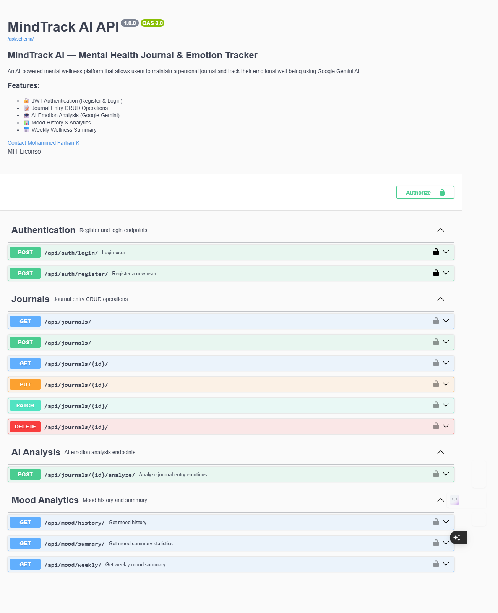
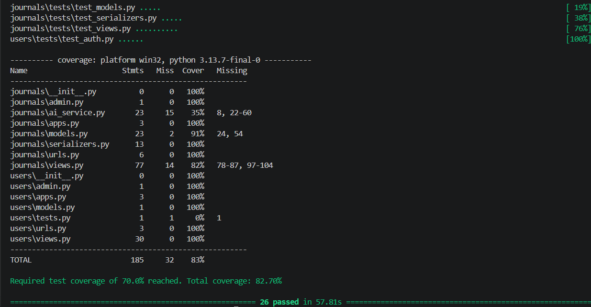

# 🧠 MindTrack AI


> AI-powered Mental Health Journal & Emotion Tracker

MindTrack AI is a mental wellness platform where users journal their
daily thoughts and receive AI-powered emotion analysis, mood tracking,
and personalized wellness suggestions using Google Gemini AI.

---

## 🚀 Features

- 🔐 JWT Authentication (Register & Login)
- 📝 Full Journal CRUD (Create, Read, Update, Delete)
- 🤖 AI Emotion Detection via Google Gemini
- 📊 Mood History & Trend Analytics
- 📅 Weekly Wellness Summary Reports
- 🔍 Search & Filter Journal Entries
- 📖 Live Swagger API Documentation

---

## 🛡️ Security & Performance Features

- **🔒 Rate Limiting:** Enforces rate limiting on the AI analysis view using `django-ratelimit` (limits users to **5 requests/minute** to protect against abuse and token costs).
- **🛡️ CORS Support:** Configured with `django-cors-headers` to allow secure frontend connections.
- **✅ Input Validation:** Strong serializer validation verifies that journal entries are not empty, have at least **10 characters**, and do not exceed **5000 characters**.
- **⚡ DB Performance:** Optimizes database lookups with `select_related('emotionanalysis')` to solve the N+1 query problem.

---

## 🛠️ Tech Stack

| Layer | Technology |
|---|---|
| Backend | Django REST Framework |
| Database | Supabase PostgreSQL |
| Authentication | JWT (djangorestframework-simplejwt) |
| AI Integration | Google Gemini API (gemini-2.0-flash) |
| API Docs | drf-spectacular (Swagger UI / ReDoc) |
| Deployment | Render |
| CI/CD | GitHub Actions |

---

## 📖 API Documentation

- 🏠 **Live Home URL:** [https://mindtrack-ai-lw6i.onrender.com/](https://mindtrack-ai-lw6i.onrender.com/)
- 📖 **Interactive Swagger UI:** [https://mindtrack-ai-lw6i.onrender.com/api/schema/swagger-ui/](https://mindtrack-ai-lw6i.onrender.com/api/schema/swagger-ui/)
- 📋 **Structured ReDoc:** [https://mindtrack-ai-lw6i.onrender.com/api/schema/redoc/](https://mindtrack-ai-lw6i.onrender.com/api/schema/redoc/)

### Endpoints

| Method | Endpoint | Description | Auth |
|---|---|---|---|
| POST | `/api/auth/register/` | Register new user | ❌ |
| POST | `/api/auth/login/` | Login & get JWT token | ❌ |
| GET | `/api/journals/` | List all entries | ✅ |
| POST | `/api/journals/` | Create journal entry | ✅ |
| GET | `/api/journals/{id}/` | Get single entry | ✅ |
| PUT | `/api/journals/{id}/` | Update entry | ✅ |
| DELETE | `/api/journals/{id}/` | Delete entry | ✅ |
| POST | `/api/journals/{id}/analyze/` | AI emotion analysis | ✅ |
| GET | `/api/mood/history/` | Mood history | ✅ |
| GET | `/api/mood/summary/` | Mood statistics | ✅ |
| GET | `/api/mood/weekly/` | Weekly report | ✅ |

---

## ⚙️ Environment Variables

Create a `.env` file in `mindtrack_backend/`:

| Variable | Description |
|---|---|
| `SECRET_KEY` | Django secret key |
| `DEBUG` | True for development |
| `DATABASE_URL` | Supabase PostgreSQL URL |
| `GEMINI_API_KEY` | Google Gemini API key |

---

## 🏃 Run Locally

```bash
# Clone the repo
git clone https://github.com/Farhan-kalady/MindTrack-AI.git
cd MindTrack-AI/mindtrack_backend

# Install dependencies
pip install -r requirements.txt

# Set up environment variables
cp .env.example .env
# Edit .env with your values

# Run migrations
python manage.py migrate

# Start server
python manage.py runserver
```

---

## 📸 Screenshots

### Swagger UI


---

## 📐 Architecture

See [docs/architecture.md](mindtrack_backend/docs/architecture.md)

---

## 🤝 Contributing

See [CONTRIBUTING.md](CONTRIBUTING.md)

---

## 📬 Postman Collection

[View API Collection](https://documenter.getpostman.com/view/50265930/2sBXwvJ8EF)

---

## 🧪 Run Tests

```bash
python manage.py test journals
```

---

## ✅ Test Coverage


---

## 👤 Author

**Mohammed Farhan K**
- GitHub: [@Farhan-kalady](https://github.com/Farhan-kalady)

---

## 📄 License

MIT License