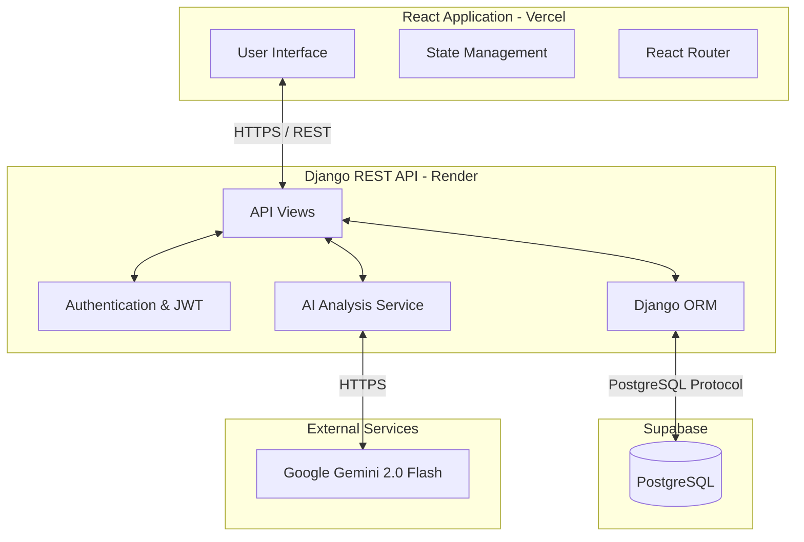

# MindTrack AI Architecture

This document provides a high-level overview of the MindTrack AI system architecture, detailing the interaction between the frontend, backend, database, and external APIs.

## High-Level Architecture Diagram

## Components

### 1. Frontend (React 18 & Vite)
- **Deployment:** Vercel
- **Styling:** Tailwind CSS with dynamic dark-mode aesthetics and Framer Motion for micro-animations.
- **Role:** Handles the user interface, client-side routing, and rendering data dynamically.

### 2. Backend (Django REST Framework)
- **Deployment:** Render
- **Role:** Acts as the central hub of the application. Handles API requests, coordinates AI tasks, enforces business logic, and manages secure JWT authentication.

### 3. Database (Supabase PostgreSQL)
- **Role:** Secure, persistent storage for user accounts, journal entries, and generated AI insights. Row Level Security (RLS) is applied to keep user data completely private.

### 4. AI Engine (Google Gemini API)
- **Role:** The core intelligence behind MindTrack AI. Processes user journal entries via the `gemini-2.0-flash` model to detect dominant emotions, assign a mood score, generate personalized wellness advice, and flag any potential crisis indicators.
